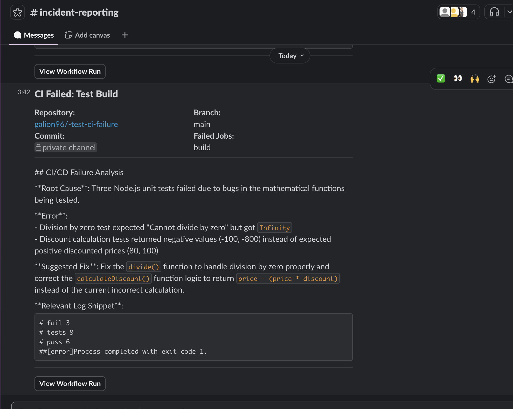
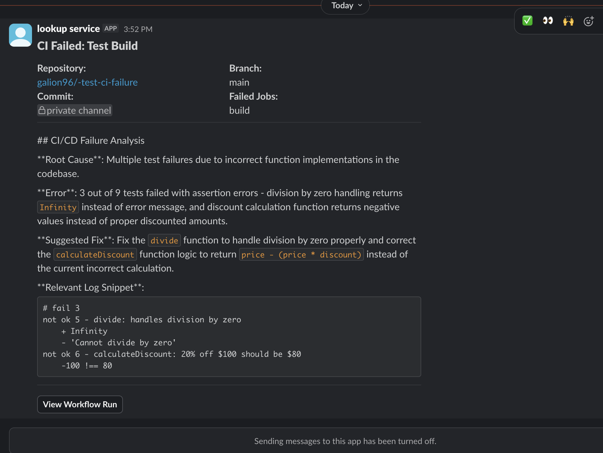

# CI Failure Summarizer

A GitHub Action that uses AI to analyze CI/CD failures and sends human-readable summaries to Slack.

**Stop scrolling through thousands of log lines.** Get instant, actionable failure summaries delivered to Slack — either to a channel or directly to the person who broke the build.

## How it works

1. Your CI workflow fails
2. This action fetches the logs from failed jobs
3. Claude AI analyzes the logs and identifies the root cause
4. A summary is sent to Slack with:
   - What went wrong
   - The specific error
   - Suggested fix
   - Link to the full logs

## Notification Modes

| Mode | Description |
|------|-------------|
| `channel` | Posts to a Slack channel via webhook (default) |
| `dm` | DMs the person who made the commit that broke the build |

## Examples

### Channel Notification


### DM Notification


## Setup

### Option A: Channel Notifications (Webhook)

#### 1. Create a Slack Incoming Webhook

1. Go to [Slack API Apps](https://api.slack.com/apps)
2. Create a new app (or use existing)
3. Enable "Incoming Webhooks"
4. Create a webhook for your desired channel
5. Copy the webhook URL

#### 2. Add to Your Workflow

```yaml
- uses: galion96/ci-failure-sumarizer@v1
  with:
    anthropic_api_key: ${{ secrets.ANTHROPIC_API_KEY }}
    slack_webhook_url: ${{ secrets.SLACK_WEBHOOK_URL }}
```

---

### Option B: DM the Committer (Bot Token)

This mode looks up the committer's email in Slack and DMs them directly.

#### 1. Create a Slack App with Bot Token

1. Go to [Slack API Apps](https://api.slack.com/apps)
2. Create a new app → "From scratch"
3. Go to **OAuth & Permissions**
4. Add these **Bot Token Scopes**:
   - `users:read.email` — Look up users by email
   - `users:read` — Read user info
   - `chat:write` — Send messages
   - `im:write` — Open DM channels
5. Click **Install to Workspace**
6. Copy the **Bot User OAuth Token** (starts with `xoxb-`)

#### 2. Add to Your Workflow

```yaml
- uses: galion96/ci-failure-sumarizer@v1
  with:
    anthropic_api_key: ${{ secrets.ANTHROPIC_API_KEY }}
    slack_bot_token: ${{ secrets.SLACK_BOT_TOKEN }}
    notification_mode: dm
    fallback_channel: C1234567890  # Optional: channel ID if user lookup fails
```

**Important:** The committer's GitHub email must match their Slack email for DM lookup to work.

---

### Get an Anthropic API Key

1. Sign up at [console.anthropic.com](https://console.anthropic.com)
2. Create an API key
3. Note: This action uses Claude Sonnet by default (~$0.003-0.01 per analysis)

### Add Secrets to Your Repository

Go to your repo's Settings > Secrets and variables > Actions, and add:

- `ANTHROPIC_API_KEY`: Your Anthropic API key
- `SLACK_WEBHOOK_URL`: Your Slack webhook URL (for channel mode)
- `SLACK_BOT_TOKEN`: Your Slack bot token (for DM mode)

## Full Workflow Examples

### Channel Mode (Webhook)

```yaml
name: Notify on Failure

on:
  workflow_run:
    workflows: ["*"]
    types: [completed]

jobs:
  notify:
    runs-on: ubuntu-latest
    if: ${{ github.event.workflow_run.conclusion == 'failure' }}
    steps:
      - name: Analyze and notify
        uses: galion96/ci-failure-sumarizer@v1
        with:
          github_token: ${{ secrets.GITHUB_TOKEN }}
          anthropic_api_key: ${{ secrets.ANTHROPIC_API_KEY }}
          slack_webhook_url: ${{ secrets.SLACK_WEBHOOK_URL }}
          run_id: ${{ github.event.workflow_run.id }}
```

### DM Mode (Bot Token)

```yaml
name: Build and Test

on: [push, pull_request]

jobs:
  build:
    runs-on: ubuntu-latest
    steps:
      - uses: actions/checkout@v4
      - run: npm install
      - run: npm test

  notify-on-failure:
    runs-on: ubuntu-latest
    needs: [build]
    if: failure()
    steps:
      - name: DM the committer
        uses: galion96/ci-failure-sumarizer@v1
        with:
          github_token: ${{ secrets.GITHUB_TOKEN }}
          anthropic_api_key: ${{ secrets.ANTHROPIC_API_KEY }}
          slack_bot_token: ${{ secrets.SLACK_BOT_TOKEN }}
          notification_mode: dm
          fallback_channel: C1234567890  # Posts here if user lookup fails
```

## Configuration Options

| Input | Description | Required | Default |
|-------|-------------|----------|---------|
| `github_token` | GitHub token to fetch logs | Yes | `${{ github.token }}` |
| `anthropic_api_key` | Anthropic API key | Yes | - |
| `slack_webhook_url` | Slack webhook URL (channel mode) | No* | - |
| `slack_bot_token` | Slack bot token (DM mode) | No* | - |
| `notification_mode` | `channel` or `dm` | No | `channel` |
| `fallback_channel` | Channel ID if DM lookup fails | No | - |
| `run_id` | Workflow run ID to analyze | No | Current run |
| `max_log_lines` | Max log lines to analyze | No | `500` |
| `claude_model` | Claude model to use | No | `claude-sonnet-4-20250514` |

*Either `slack_webhook_url` or `slack_bot_token` is required depending on mode.

## Outputs

| Output | Description |
|--------|-------------|
| `summary` | The AI-generated failure summary |
| `slack_message_ts` | Timestamp of the Slack message |
| `notified_user` | Slack user ID that was DMed (DM mode only) |

## Cost Estimation

Using Claude Sonnet with default settings:
- ~$0.003-0.01 per failure analysis
- 100 failures/month ≈ $0.30-1.00

You can reduce costs by:
- Lowering `max_log_lines`
- Using `claude-haiku-3-20240307` (cheaper, still good)

## Development

```bash
# Install dependencies
npm install

# Build the action
npm run build
```

## Contributing

Contributions are welcome! Please open an issue or PR.

## License

MIT
